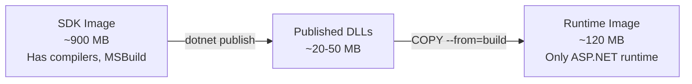
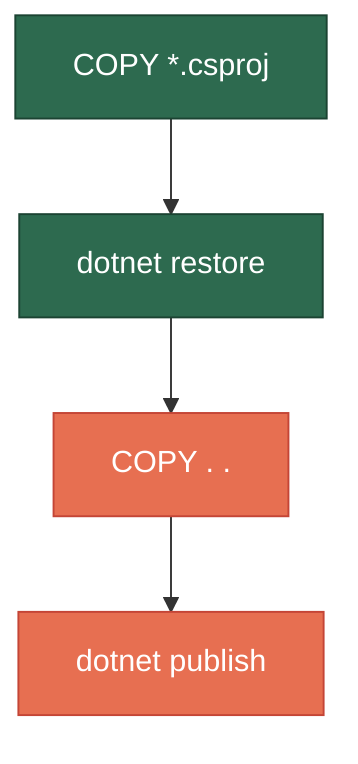
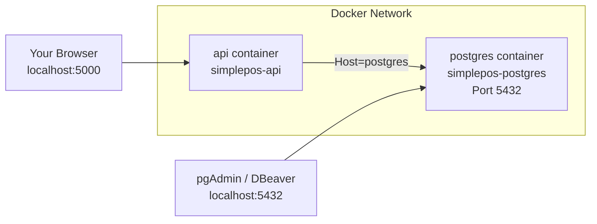
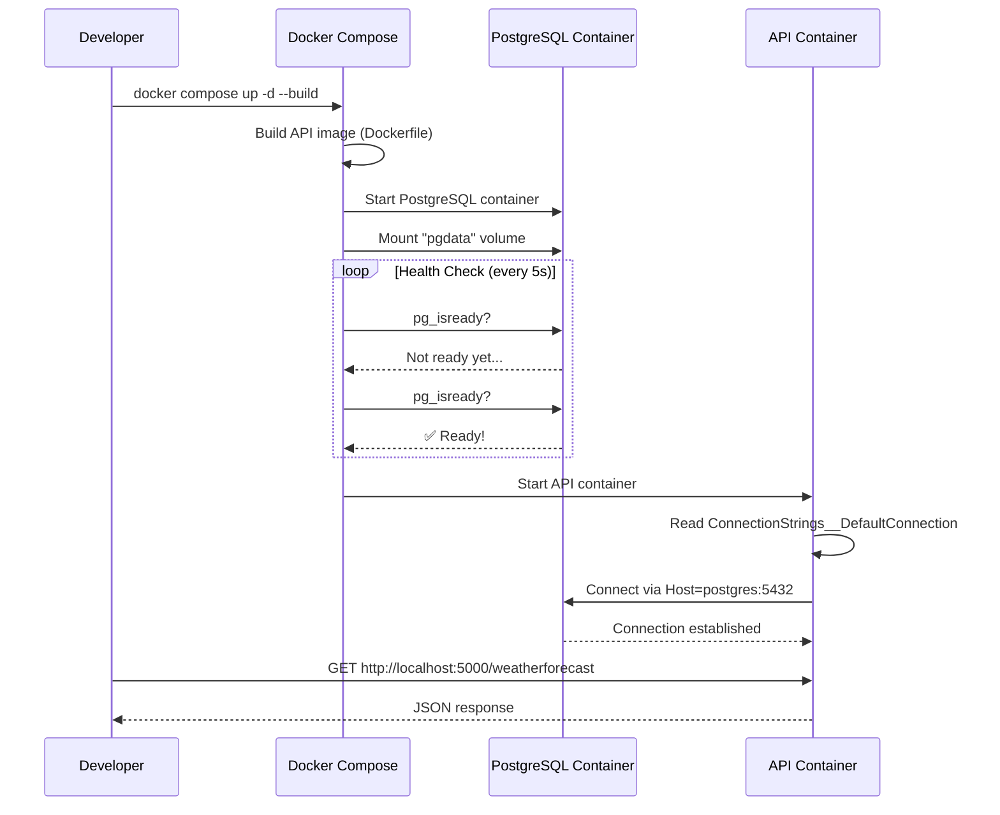

# Docker + PostgreSQL Setup Guide for SimplePos

This guide teaches you how to Dockerize your SimplePos project with a PostgreSQL database, **without modifying any existing code**. Each section explains the *what* and *why* before showing you the *how*.

---

## Table of Contents

1. [Core Docker Concepts](#1-core-docker-concepts)
2. [Project Overview](#2-your-project-at-a-glance)
3. [Step 1: Create a `.dockerignore`](#3-step-1-create-a-dockerignore)
4. [Step 2: Create the `Dockerfile`](#4-step-2-create-the-dockerfile)
5. [Step 3: Create `docker-compose.yml`](#5-step-3-create-docker-composeyml)
6. [Step 4: Configure PostgreSQL Connection](#6-step-4-configure-postgresql-connection)
7. [Step 5: Add EF Core with PostgreSQL (Npgsql)](#7-step-5-add-ef-core-with-postgresql-npgsql)
8. [Common Docker Commands](#8-common-docker-commands)
9. [How It All Fits Together](#9-how-it-all-fits-together)

---

## 1. Core Docker Concepts

Before writing any files, let's understand the building blocks:

### Image
A **read-only template** containing your application code, runtime, libraries, and OS. Think of it as a snapshot/blueprint. You build it once, and it can be used to create many containers.

### Container
A **running instance** of an image. It's an isolated process with its own filesystem, networking, and memory. You can start, stop, and destroy containers without affecting the image.

### Dockerfile
A **recipe file** — a text file with step-by-step instructions for building an image. Each instruction creates a new "layer" in the image.

### Volume
**Persistent storage** that lives outside the container. Containers are ephemeral (data is lost when they're destroyed). Volumes survive container restarts and removals — critical for databases like PostgreSQL.

### Network
Docker creates **isolated networks** so containers can talk to each other by name (e.g., your app calls PostgreSQL by the service name `postgres` instead of an IP address).

### Docker Compose
A tool for defining and running **multi-container applications** with a single YAML file. Instead of running multiple `docker run` commands with many flags, you write one `docker-compose.yml` and run `docker compose up`.

---

## 2. Your Project at a Glance

Your SimplePos project has this structure:

```
SimplePos/
├── SimplePos.slnx              # Solution file (.NET 10)
├── src/
│   ├── SimplePos.Domain/        # Domain entities, value objects
│   ├── SimplePos.Application/   # Use cases, interfaces
│   ├── SimplePos.Infrastructure/ # EF Core, repositories
│   └── SimplePos.WebApi/        # ASP.NET Web API (entry point)
└── test/
    └── Tests/                   # Unit tests
```

Key facts:
- **Target framework**: `net10.0`
- **Entry point**: `SimplePos.WebApi` (the project Docker will run)
- **Infrastructure** references Application (which references Domain) — classic Clean Architecture

---

## 3. Step 1: Create a `.dockerignore`

**Location**: Project root (`SimplePos/.dockerignore`)

**What it does**: Just like `.gitignore` tells Git what to skip, `.dockerignore` tells Docker what to **exclude** when copying files into the image. This makes builds faster and images smaller.

```dockerignore
# Build outputs — these get regenerated inside Docker
**/bin/
**/obj/

# IDE and editor files
**/.vscode/
**/.vs/
**/.idea/

# Git metadata
.git
.gitignore

# Docker files themselves (no need to copy these into the image)
**/Dockerfile
**/docker-compose.yml
**/.dockerignore

# OS junk
**/.DS_Store
**/Thumbs.db
```

### Why each exclusion matters:

| Pattern | Why exclude it? |
|---------|----------------|
| `**/bin/`, `**/obj/` | These are **local build artifacts**. Docker will run `dotnet restore` and `dotnet build` inside the container using a clean environment. Including them would bloat the image and potentially cause architecture mismatches (e.g., macOS binaries in a Linux container). |
| `.git` | The `.git` folder can be **hundreds of MB**. Your app doesn't need Git history to run. |
| `Dockerfile` / `docker-compose.yml` | Circular — the image doesn't need its own build instructions. |

---

## 4. Step 2: Create the `Dockerfile`

**Location**: Project root (`SimplePos/Dockerfile`)

This is the most important file. We'll use a **multi-stage build**, which is the industry standard for .NET applications.

```dockerfile
# ============================================================
# STAGE 1: BUILD
# ============================================================
# This stage compiles your code. It uses the full .NET SDK image
# which includes compilers, NuGet, MSBuild, etc.
# We give this stage the name "build" so we can reference it later.
FROM mcr.microsoft.com/dotnet/sdk:10.0 AS build

# Set the working directory inside the container.
# All subsequent commands run relative to this path.
WORKDIR /src

# ----------------------------------------------------------
# COPY PROJECT FILES FIRST (for layer caching)
# ----------------------------------------------------------
# Docker caches each instruction as a "layer". If a layer hasn't
# changed, Docker reuses the cached version. By copying ONLY
# the .csproj/.slnx files first and running `dotnet restore`,
# we cache the NuGet restore layer. This means if you only change
# a .cs file (not a package reference), Docker skips the slow
# restore step on subsequent builds.

COPY SimplePos.slnx ./
COPY src/SimplePos.Domain/SimplePos.Domain.csproj ./src/SimplePos.Domain/
COPY src/SimplePos.Application/SimplePos.Application.csproj ./src/SimplePos.Application/
COPY src/SimplePos.Infrastructure/SimplePos.Infrastructure.csproj ./src/SimplePos.Infrastructure/
COPY src/SimplePos.WebApi/SimplePos.WebApi.csproj ./src/SimplePos.WebApi/

# Restore NuGet packages for all projects in the solution.
# This downloads dependencies — the slowest part of a build.
RUN dotnet restore SimplePos.slnx

# ----------------------------------------------------------
# COPY EVERYTHING ELSE AND BUILD
# ----------------------------------------------------------
# Now copy the rest of the source code.
COPY . .

# Publish a release build into /app/publish.
# -c Release        → Release configuration (optimized, no debug symbols)
# -o /app/publish   → Output directory
# --no-restore      → Skip restore (we already did it above)
RUN dotnet publish src/SimplePos.WebApi/SimplePos.WebApi.csproj \
    -c Release \
    -o /app/publish \
    --no-restore


# ============================================================
# STAGE 2: RUNTIME
# ============================================================
# This stage creates the final, lean image that actually runs.
# It uses the ASP.NET runtime image — much smaller than the SDK
# because it doesn't include compilers and build tools.
FROM mcr.microsoft.com/dotnet/aspnet:10.0 AS runtime

WORKDIR /app

# Copy ONLY the published output from the build stage.
# Everything else (source code, SDK, NuGet cache) is discarded.
# This is why it's called "multi-stage" — the final image is tiny.
COPY --from=build /app/publish .

# Tell ASP.NET Core to listen on port 8080.
# (Port 80 requires root; 8080 works with non-root users)
ENV ASPNETCORE_URLS=http://+:8080

# Expose port 8080 to the outside world.
# This is documentation — it tells other developers which port
# the container uses. It doesn't actually open the port.
EXPOSE 8080

# The command that runs when the container starts.
# This launches your Web API.
ENTRYPOINT ["dotnet", "SimplePos.WebApi.dll"]
```

### Multi-Stage Build — Why?



| | Single-stage | Multi-stage |
|---|---|---|
| **Final image size** | ~900 MB (includes SDK) | ~120-150 MB (runtime only) |
| **Security surface** | Large (compilers, tools) | Small (only what you need) |
| **Build speed** | Same | Same (+ layer caching) |

### Layer Caching — Why copy `.csproj` first?



- **Green layers** (csproj + restore): Only invalidated when you **add/remove NuGet packages**. Cached most of the time.
- **Red layers** (source + publish): Invalidated on every **code change**. Must re-run.

If you copied everything at once (`COPY . .` then `dotnet restore`), *every single code change* would re-download all NuGet packages. The split saves **minutes** on each build.

---

## 5. Step 3: Create `docker-compose.yml`

**Location**: Project root (`SimplePos/docker-compose.yml`)

This file orchestrates your **two services**: the Web API and PostgreSQL.

```yaml
# The Compose file format version.
# Modern Docker Compose doesn't strictly require this, but it's
# good practice to include it for compatibility.
version: "3.8"

services:
  # ========================================================
  # SERVICE 1: PostgreSQL Database
  # ========================================================
  postgres:
    # Use the official PostgreSQL 17 image from Docker Hub.
    # "alpine" variant is smaller (~80 MB vs ~400 MB).
    image: postgres:17-alpine

    # Name the container for easy identification in `docker ps`.
    container_name: simplepos-postgres

    # Restart policy: always restart unless you explicitly stop it.
    # This means if PostgreSQL crashes, Docker will bring it back.
    restart: unless-stopped

    # Environment variables that PostgreSQL reads on first startup
    # to create the initial database and user.
    environment:
      POSTGRES_USER: simplepos_user        # Database username
      POSTGRES_PASSWORD: simplepos_secret   # Database password
      POSTGRES_DB: simplepos_db            # Database name to create

    # PORT MAPPING: host_port:container_port
    # PostgreSQL listens on 5432 inside the container.
    # We map it to 5432 on your Mac so you can connect with
    # tools like pgAdmin, DBeaver, or `psql` from your terminal.
    ports:
      - "5432:5432"

    # VOLUME: Persist database data outside the container.
    # Without this, all your data would vanish when the container
    # is removed. The named volume "pgdata" is stored on your
    # host machine and survives container recreation.
    volumes:
      - pgdata:/var/lib/postgresql/data

    # HEALTH CHECK: Docker periodically runs this command to
    # verify PostgreSQL is actually accepting connections,
    # not just "running". Other services can wait for this.
    healthcheck:
      test: ["CMD-SHELL", "pg_isready -U simplepos_user -d simplepos_db"]
      interval: 5s      # Check every 5 seconds
      timeout: 5s        # Give up after 5 seconds per check
      retries: 5          # Mark unhealthy after 5 failures
      start_period: 10s   # Grace period on container startup

  # ========================================================
  # SERVICE 2: SimplePos Web API
  # ========================================================
  api:
    # Build the image from the Dockerfile in the current directory.
    # "context: ." means the build context is the project root.
    # "dockerfile: Dockerfile" points to our Dockerfile.
    build:
      context: .
      dockerfile: Dockerfile

    container_name: simplepos-api

    restart: unless-stopped

    # Map port 8080 in the container to port 5000 on your Mac.
    # You'll access the API at http://localhost:5000
    ports:
      - "5000:8080"

    # Pass the PostgreSQL connection string as an environment variable.
    # Notice the host is "postgres" — this is the SERVICE NAME above.
    # Docker Compose creates a network where services can reach each
    # other by name. Your app doesn't need to know the IP address.
    environment:
      - ASPNETCORE_ENVIRONMENT=Development
      - ConnectionStrings__DefaultConnection=Host=postgres;Port=5432;Database=simplepos_db;Username=simplepos_user;Password=simplepos_secret

    # DEPENDS_ON with condition: Don't start the API until PostgreSQL
    # is healthy (not just started). This prevents your app from
    # crashing because the database isn't ready yet.
    depends_on:
      postgres:
        condition: service_healthy

# ========================================================
# NAMED VOLUMES
# ========================================================
# Declare named volumes here. Docker manages their lifecycle.
# Data persists across `docker compose down` (unless you add -v).
volumes:
  pgdata:
```

### Key Concepts Explained

#### Service Names as Hostnames



When you write `Host=postgres` in the connection string, Docker's internal DNS resolves `postgres` to the container's IP. You **never** hardcode IP addresses.

#### `depends_on` vs Health Checks

| Approach | What it does | Problem |
|----------|-------------|---------|
| `depends_on: [postgres]` alone | Waits for the postgres **container to start** | PostgreSQL may not be ready to accept connections yet! |
| `depends_on` + `condition: service_healthy` | Waits for the **health check to pass** | ✅ Correct — guarantees PostgreSQL is accepting connections |

#### The `__` (double underscore) in Environment Variables

```yaml
ConnectionStrings__DefaultConnection=Host=postgres;...
```

ASP.NET Core's configuration system translates `__` into `:` (colon). So this becomes:

```json
{
  "ConnectionStrings": {
    "DefaultConnection": "Host=postgres;Port=5432;..."
  }
}
```

**Environment variables override `appsettings.json`**. This means you don't need to put database credentials in your config files — they come from the environment at runtime.

#### Named Volumes (`pgdata`)

```
docker compose down       → Stops containers, removes them. Volume SURVIVES.
docker compose down -v    → Stops containers AND DELETES the volume (data gone!).
docker compose up         → Creates new containers, mounts existing volume.
```

---

## 6. Step 4: Configure PostgreSQL Connection

To connect your ASP.NET Core app to PostgreSQL, you'll eventually need to add the connection string to [appsettings.json](file:///Users/cheong/Projects/SimplePos/src/SimplePos.WebApi/appsettings.json). Here's what it would look like:

```json
{
  "Logging": {
    "LogLevel": {
      "Default": "Information",
      "Microsoft.AspNetCore": "Warning"
    }
  },
  "AllowedHosts": "*",
  "ConnectionStrings": {
    "DefaultConnection": "Host=localhost;Port=5432;Database=simplepos_db;Username=simplepos_user;Password=simplepos_secret"
  }
}
```

> [!IMPORTANT]
> **`localhost` vs `postgres`**: 
> - Use `Host=localhost` in `appsettings.json` — this is for **local development** (running the app directly on your Mac, connecting to the Dockerized database).
> - Use `Host=postgres` in the `docker-compose.yml` environment variable — this is for when the **app itself runs inside Docker** and needs to reach the database container by its service name.
> - The environment variable **overrides** the appsettings value, so both cases are handled correctly.

---

## 7. Step 5: Add EF Core with PostgreSQL (Npgsql)

Your Infrastructure project is where EF Core lives. You'll need these NuGet packages:

```bash
# Run from the project root
dotnet add src/SimplePos.Infrastructure/SimplePos.Infrastructure.csproj \
    package Npgsql.EntityFrameworkCore.PostgreSQL

dotnet add src/SimplePos.Infrastructure/SimplePos.Infrastructure.csproj \
    package Microsoft.EntityFrameworkCore.Design
```

| Package | Purpose |
|---------|---------|
| `Npgsql.EntityFrameworkCore.PostgreSQL` | The PostgreSQL **database provider** for EF Core. Translates LINQ queries into PostgreSQL-specific SQL. |
| `Microsoft.EntityFrameworkCore.Design` | Required for EF Core **CLI tools** (`dotnet ef migrations add`, `dotnet ef database update`). Only needed at design-time. |

Then, in your `Program.cs`, you'd register the DbContext:

```csharp
// In Program.cs (SimplePos.WebApi)
builder.Services.AddDbContext<AppDbContext>(options =>
    options.UseNpgsql(builder.Configuration.GetConnectionString("DefaultConnection")));
```

> [!NOTE]
> The `AppDbContext` class would live in `SimplePos.Infrastructure` and be registered here in the WebApi startup. This keeps your Clean Architecture intact — the WebApi (composition root) wires everything up, but the Infrastructure project owns the implementation.

---

## 8. Common Docker Commands

Here's your day-to-day cheatsheet:

### Starting & Stopping

```bash
# Build images and start all services in the background (-d = detached)
docker compose up -d --build

# Start without rebuilding (uses cached images)
docker compose up -d

# Stop all services (containers removed, volumes preserved)
docker compose down

# Stop AND delete database data (nuclear option)
docker compose down -v
```

### Inspecting

```bash
# See running containers
docker compose ps

# Follow live logs from all services
docker compose logs -f

# Follow logs from just the API
docker compose logs -f api

# Follow logs from just PostgreSQL
docker compose logs -f postgres
```

### Database Access

```bash
# Open a psql shell inside the running PostgreSQL container
docker compose exec postgres psql -U simplepos_user -d simplepos_db

# Run a quick query
docker compose exec postgres psql -U simplepos_user -d simplepos_db \
    -c "SELECT tablename FROM pg_tables WHERE schemaname = 'public';"
```

### Rebuilding

```bash
# Rebuild only the API image (e.g., after code changes)
docker compose build api

# Rebuild from scratch (no cache — useful if something is broken)
docker compose build --no-cache
```

### EF Core Migrations (run from your Mac, not inside Docker)

```bash
# Create a migration
dotnet ef migrations add InitialCreate \
    --project src/SimplePos.Infrastructure \
    --startup-project src/SimplePos.WebApi

# Apply migrations to the Dockerized PostgreSQL
dotnet ef database update \
    --project src/SimplePos.Infrastructure \
    --startup-project src/SimplePos.WebApi
```

> [!TIP]
> These commands run from your Mac against the PostgreSQL container exposed on `localhost:5432`. That's why we mapped the port in docker-compose and used `Host=localhost` in appsettings.json.

---

## 9. How It All Fits Together

Here's the complete flow from `docker compose up` to a running system:



### File Summary

Here's every file you would create and where it goes:

```
SimplePos/                          ← Project root
├── .dockerignore                   ← [NEW] Tells Docker what to exclude
├── Dockerfile                      ← [NEW] Recipe for building the API image
├── docker-compose.yml              ← [NEW] Orchestrates API + PostgreSQL
├── SimplePos.slnx                  ← (existing, unchanged)
├── src/
│   ├── SimplePos.WebApi/
│   │   ├── appsettings.json        ← (add ConnectionStrings section)
│   │   └── Program.cs              ← (add DbContext registration)
│   └── SimplePos.Infrastructure/
│       └── SimplePos.Infrastructure.csproj  ← (add Npgsql packages)
└── ...
```

> [!NOTE]
> **Only 3 new files** are added to your project (`.dockerignore`, `Dockerfile`, `docker-compose.yml`). The changes to existing files are minimal — a connection string in appsettings and a `AddDbContext` call in Program.cs.

---

## Quick Glossary

| Term | One-line explanation |
|------|---------------------|
| **Image** | A frozen snapshot of your app + dependencies (like a `.zip` of everything needed to run) |
| **Container** | A running instance of an image (like unzipping and executing it) |
| **Volume** | Persistent storage that survives container restarts (for database data) |
| **Compose** | A tool to run multiple containers together from one YAML file |
| **Multi-stage build** | Build in a fat image (SDK), copy only the output to a slim image (runtime) |
| **Layer caching** | Docker reuses unchanged build steps to make rebuilds fast |
| **Health check** | A periodic "are you alive?" command that Docker runs against a container |
| **Npgsql** | The .NET driver/provider for PostgreSQL |
